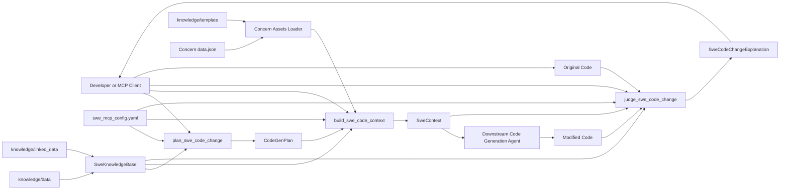
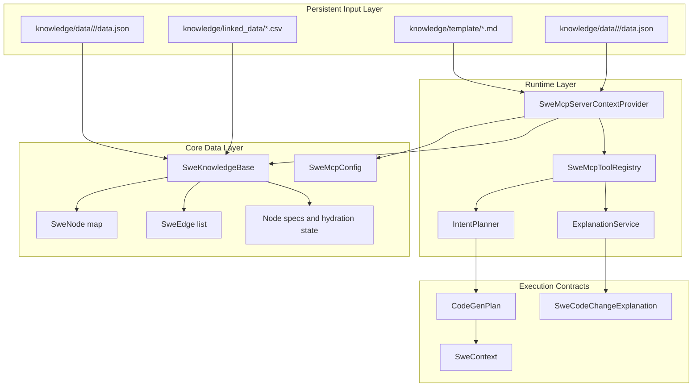
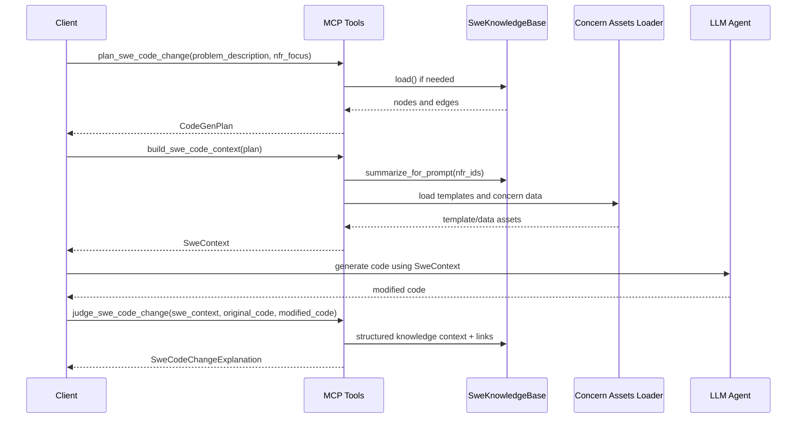

# Agent Execution Architecture: Data Flow and Component Integration

This document describes how data moves through the supervisor-agent pipeline and how components integrate during execution.

## 1) End-to-End Data Flow

## 2) Data Components Integration

## 3) Sequence: Agent Execution

## 4) Data Objects by Stage

| Stage | Input Objects | Output Objects |
|---|---|---|
| Stage 1 Planning | problem description, optional target language, optional NFR focus, SweMcpConfig, SweKnowledgeBase | CodeGenPlan |
| Stage 2a Context Build | CodeGenPlan, SweKnowledgeBase, concern templates/data | SweContext |
| Stage 2b Judge/Explain | SweContext, original code, modified code, SweKnowledgeBase, SweMcpConfig | SweCodeChangeExplanation |

## 5) Notes on Structured Knowledge Integration

- Nodes are discovered from knowledge/data domain folders.
- Structural edges are rebuilt from ground truth entries and categories.
- Linked-data CSV relations act as semantic links and NFR/category hints when endpoints are valid in the discovered graph.
- Lazy node detail loading can be enabled via knowledge_base.lazy_load_nodes in configuration.

## 6) PlantUML Sources

For qualification, keep only a concise architecture subset:

- `docs/architecture/component-interactions.puml` (high-level system components)
- `docs/architecture/domain-uml.puml` (high-level domain concepts)
- `docs/architecture/basic-user-interaction-sequence.puml` (high-level experiment sequence)

Optional appendix diagrams (for implementation-level discussions):

- `docs/architecture/services-layer-connections.puml`
- `docs/architecture/knowledge-base-loading.puml`
